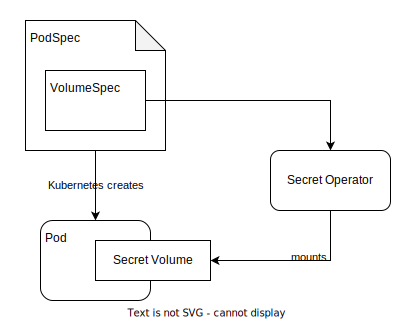

<p align="center">
  
</p>
<h1 align="center">Stackable Secret Operator</h1>

[](https://GitHub.com/stackabletech/secret-operator/graphs/commit-activity)
[](https://docs.stackable.tech/home/stable/contributor/index.html)
[](./LICENSE)

[Documentation](https://docs.stackable.tech/secret-operator/stable/index.html) | [Quickstart](http://example.com/) | [Stackable Data Platform](https://stackable.tech/) | [Platform Docs](https://docs.stackable.tech/)

<!-- Abstract -->

The Secret Operator by [Stackable](https://stackable.tech/).
This is a Kubernetes Operator to provision and inject secrets for Kubernetes Pods. It is part of the [Stackable Data Platform](https://stackable.tech/), a curated selection of the best open source data apps like Kafka, Druid, Trino or Spark, all working together seamlessly. Based on Kubernetes, it runs everywhere – on prem or in the cloud.

## Quickstart

The best way to get started with this operator (and the platform) is to use `stackablectl`. Download the latest [release](https://github.com/stackabletech/stackablectl/releases) and have a look at the [docs](https://docs.stackable.tech/stackablectl/stable/index.html).

You can install this operator by running:

```
stackablectl operator install secret
```

See it in action in one of our [Demos](https://stackable.tech/en/demos/).

## What does it do?

The Secret Operator provisions and mounts secrets, but unlike the default Kubernetes Secret mechanism, Secrets can be created and mouted dynamically based on Pod properties. The Operator supports:

- Generating TLS certificates on demand and mounting them
- Handling XYZ
- And something else

## How it works

The Secret Operator is deployed as a DaemonSet and provides a CSI to mount files directly into Pods.

  

## About The Stackable Data Platform

This operator is written and maintained by [Stackable](https://www.stackable.tech) and it is part of a larger platform. It is used by the other Operators to - for example - provision TLS certificates for secure traffic.


### Other Operators

These are the Operators currently part of the Stackable Data Platform, many of which use the Secret Operator.

- [Apache Airflow Operator](https://github.com/stackabletech/airflow-operator)
- [Apache Druid Operator](https://github.com/stackabletech/druid-operator)
- [Apache HBase Operator](https://github.com/stackabletech/hbase-operator)
- [Apache Hadoop HDFS Operator](https://github.com/stackabletech/hdfs-operator)
- [Apache Hive Operator](https://github.com/stackabletech/hive-operator)
- [Apache Kafka Operator](https://github.com/stackabletech/kafka-operator)
- [Apache NiFi Operator](https://github.com/stackabletech/nifi-operator)
- [Apache Spark Operator](https://github.com/stackabletech/spark-k8s-operator)
- [Apache Superset Operator](https://github.com/stackabletech/superset-operator)
- [Trino Operator](https://github.com/stackabletech/trino-operator)
- [Apache ZooKeeper Operator](https://github.com/stackabletech/zookeeper-operator)
- [OpenPolicyAgent Operator](https://github.com/stackabletech/opa-operator)

## Contributing

Contributions are welcome. Follow our [Contributors Guide](https://docs.stackable.tech/home/stable/contributor/index.html) to learn how you can contribute.

## Further Reading

Here are some links if you want to learn more about the operator

- Link to a Blog Post
- Another link to content

## License

[Open Software License 3.0](./LICENSE)
