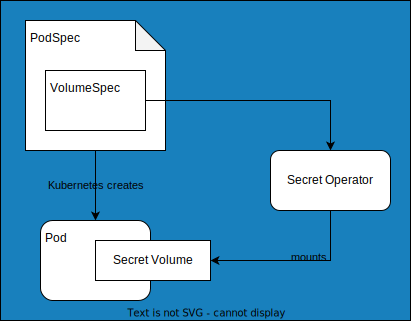

  

<h1 align="center">Stackable Secret Operator</h1>

<!-- Abstract -->

This is a Kubernetes Operator to provision and inject secrets for Kubernetes pods. Compared to Kubernetes' native secret mounts, this permits secrets to be selected dynamically based on properties of the `Pod`. Have a look at the [Documentation](https://docs.stackable.tech/secret-operator/stable/index.html) for more information.

<!-- Quickstart section left out, because this operator doesn't do anything stand-alone -->

## How it works

How does it work actually?

This operator is used by other Stackable operators to provision secrets and certificates.
It is deployed as a DaemonSet and provides a CSI to mount files directly into Pods. etc. etc.

  

## About The Stackable Data Platform

This operator is written and maintained by [Stackable](https://www.stackable.tech) and it is part of a larger platform.

## The Operators

- [Apache Airflow Operator](https://github.com/stackabletech/airflow-operator)
- [Apache Druid Operator](https://github.com/stackabletech/druid-operator)
- [Apache HBase Operator](https://github.com/stackabletech/hbase-operator)
- [Apache Hadoop HDFS Operator](https://github.com/stackabletech/hdfs-operator)
- [Apache Hive Operator](https://github.com/stackabletech/hive-operator)
- [Apache Kafka Operator](https://github.com/stackabletech/kafka-operator)
- [Apache NiFi Operator](https://github.com/stackabletech/nifi-operator)
- [Apache Spark Operator](https://github.com/stackabletech/spark-k8s-operator)
- [Apache Superset Operator](https://github.com/stackabletech/superset-operator)
- [Trino Operator](https://github.com/stackabletech/trino-operator)
- [Apache ZooKeeper Operator](https://github.com/stackabletech/zookeeper-operator)
- [OpenPolicyAgent Operator](https://github.com/stackabletech/opa-operator)

## Contributing

Contributions are welcome! Follow our [Contributors Guide](https://docs.stackable.tech/home/stable/contributor/index.html) to learn how you can contribute.

## Further Reading

- Link to a Blog Post

## License

[Open Software License 3.0](./LICENSE)
